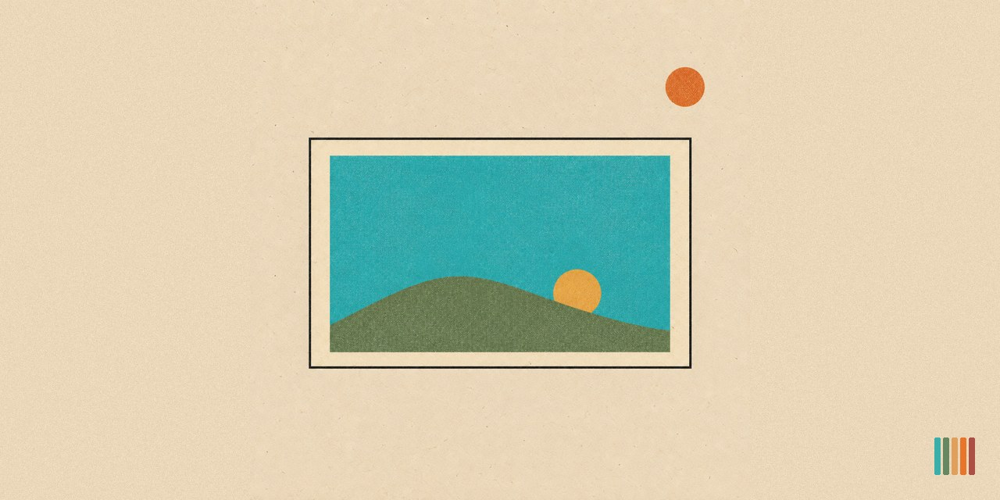

# pvc-img-gen-codex

<p align="center"></p>

  

> Real images from Claude Code, made with your ChatGPT account through the Codex CLI. One PNG per call, verified on disk. Windows, macOS and Linux.

`pvc-img-gen-codex` (display name: **PVC Image Gen Codex**) is a Claude Code skill that lets Claude make and edit images. Claude cannot paint, but the OpenAI ChatGPT VS Code extension bundles a Codex CLI that can, signed in to your ChatGPT account. This skill finds that binary on your system, writes the brief the way the model responds to, runs one image per call, checks the file exists and opens, and hands the result to `pvc-image-check` for the six-fingers pass when that skill is installed. Runs spend ChatGPT quota, not Claude tokens. Made by Pro Vibe Coding for anyone who builds pages, posts and decks that need pictures that do not exist yet.

**The free prompt version:** the same method as one pasted prompt, with no skill to install, lives at [provibecoding.app/resources/image-prompt](https://provibecoding.app/resources/image-prompt/). This skill is the full version: it finds Codex on its own, verifies size and transparency, and triggers on plain words.

## Table of contents

- [Why this exists](#why-this-exists)
- [What it does](#what-it-does)
- [Where it runs](#where-it-runs)
- [Install](#install)
- [Usage](#usage)
- [The scripts](#the-scripts)
- [How it compares](#how-it-compares)
- [Known limitations](#known-limitations)
- [Changelog](#changelog)
- [License](#license)

## Why this exists

Every website, carousel and share card needs images, and stock photos read as stock. Codex renders on-brand images through a ChatGPT account many people already pay for, but the raw CLI has traps: a version number in the binary path that changes on every extension update, one bundle holding binaries for several systems, an `-i` flag that swallows the prompt if it comes second, a `--full-auto` flag that Codex 0.154 removed, and a habit of saying "saved" when nothing hit the disk. This skill removes all of them, then makes the next step (checking the render for AI mistakes) automatic.

## What it does

- **Finds Codex** on PATH, in the usual install folders (Homebrew, npm global), or inside the newest `openai.chatgpt` extension bundle for your system and CPU, no hard-coded version or platform
- **Makes** one image from a brief, saved where you say, about 2 minutes
- **Edits** an existing image while keeping named parts unchanged (six faces survived a background swap)
- **Runs batches** of independent renders in parallel, six at a time proven
- **Verifies** the PNG opens, reports width, height and mode, and checks that a transparent cutout has real alpha
- **Hands off** every render to `pvc-image-check` before webp processing or commit, when that skill is installed

## Where it runs

| Place | Works? |
|-------|--------|
| Claude Code in a terminal, VS Code, Cursor, Windsurf or a JetBrains IDE | Yes, when Codex is signed in on that machine |
| The Claude desktop app, in a local session | Yes, same condition; the finder also checks the Homebrew and npm folders a desktop app may not have on its PATH |
| Windows, macOS, Linux, WSL and Remote SSH | Yes; the finder reads the `bin` folder that matches the system and CPU it runs on |
| Claude Code on the web (claude.ai/code), a session started as Cloud, or any other cloud sandbox | No. There is no signed-in Codex there, and the skill says so instead of trying to install one |

## Install

1. Install the OpenAI ChatGPT extension in VS Code (marketplace id `openai.chatgpt`) and sign in with your ChatGPT account. Or install the CLI: `npm i -g @openai/codex` (macOS also: `brew install --cask codex`), then `codex login`
2. Copy this folder to `<your-project>/.claude/skills/pvc-img-gen-codex/`:

```
your-project/
└── .claude/
    └── skills/
        └── pvc-img-gen-codex/
            ├── SKILL.md
            ├── README.md
            ├── REQUIREMENTS.md
            ├── LICENSE
            ├── NOTICE
            ├── TRADEMARK.md
            ├── assets/          (README artwork)
            └── scripts/
                ├── find_codex.py
                ├── gen_image.py
                └── test_skill.py
```

   **From the GitHub release zip:** it unpacks to a folder named `pvc-img-gen-codex-<version>` (for example `pvc-img-gen-codex-0.2.0`). Rename that folder to `pvc-img-gen-codex` before you place it. A project skill takes its command name from the directory name, so an unrenamed folder shows up as `/pvc-img-gen-codex-0.2.0`. A `git clone` gives you the right folder name already
3. Optional: `pip install pillow` for size and transparency verification (Ubuntu and Debian: `sudo apt install python3-pil`; Homebrew Python refuses a bare pip install, so use a venv or `pip3 install --break-system-packages pillow`)
4. Claude Code watches `.claude/skills/`, so the skill shows up in the running session. If you just created `.claude/skills/` for the first time, restart Claude Code (reload the VS Code window, or quit and relaunch `claude` in a terminal) so it starts watching that folder
5. Type `/` in the prompt box and confirm `/pvc-img-gen-codex` is in the list
6. Ask Claude to run the finder once. It prints the Codex path, or the install hint

Every command below shows `python`. On macOS and Linux use `python3` when `python` is missing or is Python 2; on Windows use `py` when `python` is not found or opens the Microsoft Store. Full dependency list with check commands: [REQUIREMENTS.md](REQUIREMENTS.md).

## Usage

Ask in plain words. All of these trigger the skill:

- "Generate the hero image for the pizza page"
- "Make me a picture of a red apple on a white table"
- "Get a transparent PNG of the mascot for the header"
- "Swap the background on hero.png for a night street, keep the people"
- "We need six team portraits"

Claude picks a mode (Make, Edit, Batch), writes the brief, runs the script, shows you the render, and runs the check. Each render prints one status line: `OK` with the file and size, `FAIL` with the Codex output tail, `QUOTA` when ChatGPT refused, or `NO-CODEX` with the install hint.

### Example

```
You: make me a picture of a red apple on a white table
```

Agent response:

```
Mode: Make
OK: tests/test-apple.png 1402x1122 RGB 1.7 MB (159s)
Seen: one red apple with stem, centered on white painted planks, soft left light, no text.
Next: pvc-image-check is not installed here; my own look finds one apple, one stem, one shadow, nothing doubled.
```

## The scripts

Run them, do not read them. All three live in `scripts/`.

`find_codex.py` prints the Codex binary path or `NOT FOUND`:

```bash
python .claude/skills/pvc-img-gen-codex/scripts/find_codex.py
```

`gen_image.py` makes or edits one image and verifies it:

```bash
python .claude/skills/pvc-img-gen-codex/scripts/gen_image.py --cwd assets/img --out hero.png "<brief>"
python .claude/skills/pvc-img-gen-codex/scripts/gen_image.py --cwd assets/img --out hero-v2.png --edit hero.png "<keep X exactly; change only Y>"
python .claude/skills/pvc-img-gen-codex/scripts/gen_image.py --cwd assets/img --out mascot.png --transparent "<brief, isolated on a fully TRANSPARENT background>"
```

Exit codes: 0 ok, 1 no usable file, 2 usage error, 3 Codex missing or not runnable, 4 quota or auth. On a Linux box or container where Codex cannot start its own sandbox, add `--sandbox danger-full-access` and keep `--cwd` on the image folder.

`test_skill.py` runs the offline checks and spends no quota; the last line reads `N/N checks passed`:

```bash
python .claude/skills/pvc-img-gen-codex/scripts/test_skill.py
```

## How it compares

| | pvc-img-gen-codex | Raw `codex exec` | Local ComfyUI |
|---|---|---|---|
| Needs | ChatGPT account | ChatGPT account | local GPU, ComfyUI running |
| Finds the binary after an update | yes, on Windows, macOS and Linux | no, path has the version and platform in it | n/a |
| Verifies the file exists and opens | yes | no | partial |
| Transparency check | yes, real alpha verified | no | no |
| Edit with invariants | yes, prompt-before-flag handled | easy to get wrong | no |
| Object-logic check after the render | built in, by hand or through `pvc-image-check` | manual | manual |

## Known limitations

- One image per call by design; batches are parallel calls, not one multi-image run
- Render size is whatever Codex returns (often 1024 to 1536 on the long edge); never upscale, output at native size
- Two edits on one image is the cap; softness compounds after that, so fold the constraints into a fresh brief
- Text in images: a few short strings work, long copy does not
- Every render spends ChatGPT quota; confirm your plan includes Codex with one test render
- Needs a signed-in Codex on the same machine, so the web version of Claude Code cannot run it
- Verified live on Windows. On macOS and Linux the finder's folder logic is covered by the offline test suite against the extension's real folder names; a live report from either is welcome

## Changelog

- v0.2.1 (2026-09-22): README shows the cream banner `assets/pvc-img-gen-codex-banner.jpg` full width under the title, the card art on a sheet in its own paper color with the PVC five-bar mark bottom right; the social preview matches it with the mark bottom left. Docs only, no change to what the skill does
- v0.2.0 (2026-09-22): runs on macOS and Linux as well as Windows. The finder picks the `bin` folder for the system and CPU it runs on (one extension bundle holds several), looks in the Homebrew and npm folders a desktop app may not have on PATH, and searches the `.vscode-server`, VSCodium and Windsurf extension folders too. New `--sandbox` option for Linux boxes where Codex cannot start its sandbox, a `chmod +x` hint when the binary is not executable, the npm `codex.cmd` shim on Windows accepted but ranked below the extension's `codex.exe`, a `test_skill.py` with offline checks that spend no quota, and docs written for every system
- v0.1.2 (2026-09-18): Codex CLI 0.154 removed `--full-auto`, so every run failed before it started. gen_image.py now sends `--sandbox workspace-write --skip-git-repo-check`, which old and new Codex versions accept, and runs outside a git repo too. Verified with 35 live renders and 6 live edits
- v0.1.1 (2026-09-04): description and trigger list now send PVC skill card art to pvc-skill-art, which drives this skill's gen_image.py for its renders
- v0.1.0 (2026-08-29): first release. Finder, generate, edit, transparency check, batch guidance, hand-off to pvc-image-check. Verified with a live render (159s) and a live edit (100s)

## License

This project is licensed under the [Apache License 2.0](LICENSE). See [LICENSE](LICENSE) and [NOTICE](NOTICE) for details.

"Pro Vibe Coding" and "PVC" are trademarks. The license does not grant rights to use them. See [TRADEMARK.md](TRADEMARK.md).

Claude and Claude Code are trademarks of Anthropic. This project is independent. It is not affiliated with, endorsed by, or sponsored by Anthropic.
